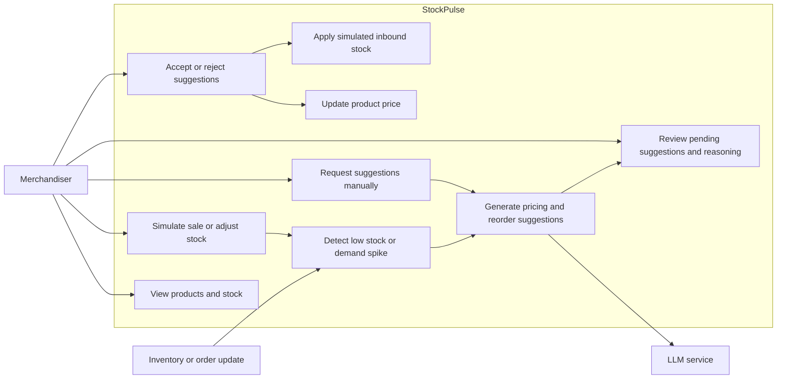

# StockPulse Use Cases

## Use-Case Diagram

## Cases to Cover

- **View catalog:** See product stock, reorder threshold, current price, demand velocity, and status.
- **Inventory-low trigger:** A stock update or sale takes stock below its threshold; generate pending pricing and reorder suggestions asynchronously.
- **Demand-spike trigger:** A sale or velocity update exceeds the configured threshold; generate suggestions with a `DEMAND_SPIKE` reason.
- **Manual request:** Request a pricing or reorder suggestion for a product.
- **AI failure:** Invalid, unavailable, or timed-out LLM output falls back to rule-based suggestions; no trigger silently drops recommendations.
- **Review and decide:** View suggestions with reasoning, confidence, and trigger reason; accept or reject each type.
- **Apply accepted decision:** Accepting pricing updates the product price; accepting reorder increases stock. Rejection leaves product values unchanged.
- **Prevent duplicates:** Repeated signals do not create duplicate pending suggestions for the same product, trigger reason, and suggestion type.
