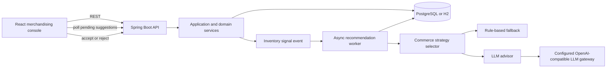

# StockPulse: AI Inventory and Dynamic Pricing

StockPulse is a merchandising advisor for a small commerce catalog. It detects low-stock and demand-spike signals, creates pricing and replenishment suggestions, and presents them for human review. Suggestions do not change live prices or inventory until a merchandiser accepts them.

## Run Locally

The backend uses Java 21, Maven Wrapper, and an in-memory H2 database. It does not require PostgreSQL and starts with an empty catalog; no seed data is inserted.

Start the backend in PowerShell (set `JAVA_HOME` to your JDK 21 installation, not a JRE):

```powershell
$env:JAVA_HOME = 'C:\path\to\jdk-21'
$env:Path = "$env:JAVA_HOME\bin;$env:Path"
Set-Location backend\stockpulse
.\mvnw.cmd spring-boot:run
```

In a second terminal, start the React console:

```powershell
Set-Location frontend
npm install
npm run dev
```

Open `http://localhost:5173`. The backend health check is `http://localhost:8080/actuator/health`; the local H2 console is `http://localhost:8080/h2-console` with JDBC URL `jdbc:h2:mem:stockpulse`, user `sa`, and a blank password. This database is in-memory and resets when the backend stops.

LLM requests use the OpenAI-compatible gateway settings in `backend/stockpulse/.env`. Copy `backend/stockpulse/.env.example` to `.env` in that directory and set `LLM_API_KEY`; Spring Boot loads it at startup. The local `.env` is Git-ignored. Without a key, recommendations use the rule-based advisor. Never commit a working key. The provided `llm.txt` contains credential-like values; rotate them and do not send its cookie header.

## High-Level Architecture



### Backend: Spring Boot 4 and Java 21

Organize the backend around domain behavior rather than putting all logic in controllers:

- **API layer:** REST controllers, request validation, response DTOs, and consistent error responses.
- **Application layer:** use cases for catalog reads, stock changes, simulated orders, suggestion generation, and suggestion decisions.
- **Domain layer:** `Product`, `InventorySnapshot`, `PricingSuggestion`, and `ReorderSuggestion`, including their state transitions and business invariants.
- **Strategy layer:** shared commerce-advisor contract with AI-backed and deterministic rule-based implementations. Resolve the active strategy from a runtime-changeable setting so HTTP and event-driven requests use the same selection path.
- **Infrastructure layer:** Spring Data JPA repositories, transaction boundaries, event handling, and the LLM gateway client.

Use H2 locally for this milestone. No external database is required. Keep persistence behind repositories so the domain and strategy code do not depend on the database choice.

### Recommendation Flow

1. A stock update or simulated order commits its inventory change and publishes an inventory signal.
2. An asynchronous handler evaluates the signal against the reorder threshold and configurable demand-spike threshold. The HTTP request returns without waiting for the LLM.
3. The active commerce strategy produces both a pricing suggestion and a reorder suggestion. The AI path receives product context, category demand context, and the specific trigger reason. The rule strategy is used if the LLM times out, returns invalid output, or fails validation.
4. Persist suggestions as `PENDING`, including their trigger reason, confidence, and reasoning. Prevent duplicate pending suggestions for the same product, trigger reason, and suggestion type.
5. The React console refreshes pending suggestions and shows whether each came from `INVENTORY_LOW`, `DEMAND_SPIKE`, or a manual request.
6. Accept/reject is an explicit human checkpoint. Accepting a pricing suggestion updates the product price; accepting a reorder suggestion simulates inbound stock. Apply each decision atomically and reject invalid or repeated state transitions.

For the first implementation, Spring transaction-bound events with `@TransactionalEventListener(AFTER_COMMIT)` and `@Async` are sufficient. If recommendation delivery must survive process restarts or scale across instances, introduce a durable queue or transactional outbox rather than relying on in-memory events alone.

### LLM Integration

The supplied connection details describe an OpenAI-compatible chat-completions gateway. Call it only from the Spring Boot backend; the browser must never receive the bearer token. Configure the base URL, model, API key, and any required product-identification header through environment-backed application properties. Keep the `/v1/chat/completions` path and provider-specific request mapping inside the gateway adapter.

Use separate prompt templates for low inventory and demand spikes. Parse the response into typed DTOs, validate values before persistence (positive bounded price, direction consistency, positive integer reorder quantity, and confidence from 0 to 1), and fall back to rule-based results on timeout, provider errors, malformed JSON, or invalid recommendations. Add request timeouts and avoid logging credentials or sensitive headers.

Do not commit API keys, cookies, or other credentials. The provided `llm.txt` currently contains credential-like values; revoke or rotate those values, remove them from any shared or committed copy, and load replacements from environment variables. A cookie should not be sent unless the gateway owner confirms it is required.

### Frontend: React 18 with Vite

Build a focused merchandising console, not a storefront:

- Product list with SKU, category, stock, reorder threshold, current price, demand velocity, and status.
- Pending pricing and reorder suggestions with recommendation, confidence, reasoning, and trigger badge.
- Accept/reject actions for each suggestion type, with clear loading, success, and error states.
- Simulated-sale and stock-adjustment actions to exercise the automatic trigger flow.
- Poll for pending suggestions or provide a manual refresh. Keep API access in a small client layer and model loading/error states explicitly.

Configure the frontend API base URL through environment configuration. Enable narrowly scoped CORS for the local Vite origin during development; do not use permissive production CORS settings. Server-Sent Events for streaming AI reasoning can be added later without changing the approval workflow.

## Initial API Surface

Use JSON DTOs and validate inputs at the API boundary. Keep suggestion generation asynchronous for stock/order signals.

| Method | Endpoint | Purpose |
| --- | --- | --- |
| `POST` | `/products` | Create a product with initial price and stock |
| `GET` | `/products?status=&category=` | List and filter products |
| `GET` | `/suggestions?status=PENDING` | Load suggestions for the console |
| `PATCH` | `/products/{id}/stock` | Update stock and publish an inventory signal |
| `PATCH` | `/products/{id}/metrics` | Edit nonnegative demand velocity and reorder threshold |
| `POST` | `/products/{id}/orders` | Simulate a sale, decrement stock, and update demand velocity |
| `POST` | `/products/{id}/suggest-pricing` | Request a manual pricing suggestion |
| `POST` | `/products/{id}/suggest-reorder` | Request a manual reorder suggestion |
| `PATCH` | `/pricing-suggestions/{id}` | Accept or reject a pricing suggestion |
| `PATCH` | `/reorder-suggestions/{id}` | Accept or reject a reorder suggestion |

Keep the approval action explicit in the request contract. A request to generate advice must never publish a price or silently place an order.

## Core Data and State

- **Product:** SKU, name, category, current price, stock level, reorder threshold, demand velocity, and lifecycle status. Reserve nullable extension fields such as `costPrice`, `marginFloor`, and `supplierId` for later iterations.
- **InventorySnapshot:** product reference, observed stock and demand values, and capture time; use it to retain the context behind a recommendation.
- **PricingSuggestion:** product, current and recommended price, direction, confidence, reasoning, status, trigger reason, and timestamps.
- **ReorderSuggestion:** product, current stock, recommended quantity, suggested lead time, confidence, reasoning, status, trigger reason, and timestamps.

Suggestion status follows `PENDING -> ACCEPTED | REJECTED`; terminal suggestions cannot be decided again. Product lifecycle includes `ACTIVE`, `PRICE_REVIEW_PENDING`, and `OUT_OF_STOCK`. Keep suggestion status authoritative and derive or update the product review status consistently when pending suggestions are created and resolved.

## Repository Document and Code Structure

```text
.
|-- README.md
|-- README-use-cases.md
|-- architecture.md
|-- ADR.md
|-- docs/
|   |-- api/
|   |   `-- openapi.yaml
|   `-- prompts/
|       |-- inventory-low.md
|       `-- demand-spike.md
|-- backend/
|   `-- stockpulse/
|       |-- pom.xml
|       `-- src/
|           |-- main/java/com/example/stockpulse/
|           `-- test/
|-- frontend/
|   |-- package.json
|   `-- src/
|       |-- api.ts
|       |-- NewProductDialog.tsx
|       |-- StockPulseApp.tsx
|       `-- stockpulse.css
`-- .env.example
```

Keep credentials in local environment files that are excluded from version control. Commit only `.env.example` with variable names and non-secret example values. Store schema migrations and safe demo seed data under the backend resources directory; do not make production startup depend on demo data.

### Documents to Maintain

- **`README.md`:** purpose, architecture, prerequisites, environment variables, local startup steps, API overview, seed/demo flow, and test commands. Keep the quick-start path accurate enough to run the app from a clean checkout.
- **`ADR.md`:** record important choices as they are made. For each entry use **Context, Options, Decision, Tradeoffs**. Cover commerce logic boundaries, unified versus separate pricing/reorder advisor contracts, runtime strategy selection, LLM validation/fallback, event delivery and idempotency, and deferred scope. Point extension decisions to the relevant code location.
- **`docs/api/openapi.yaml`:** endpoint schemas, validation constraints, response/error shapes, and examples. Update it when the API changes.
- **`docs/prompts/inventory-low.md` and `docs/prompts/demand-spike.md`:** distinct prompt intent, required input context, expected JSON shape, guardrails, and representative test cases. Do not put secrets or real customer data in prompts.
- **`.env.example`:** names and safe placeholders for backend database and LLM settings, plus the frontend API base URL. Never include working credentials.

## Verification and Demo

Test the domain state transitions and recommendation bounds with unit tests. Add API/integration tests for stock/order triggers, duplicate suppression, async rule fallback, and accept/reject side effects. Add a frontend test for the pending suggestion and approval flow.

The primary demo path is: load seeded products, simulate a sale that takes one below its reorder threshold, refresh the console, show automatically generated pricing and reorder suggestions with an `INVENTORY_LOW` badge, then accept the pricing suggestion and verify the product price changed. A separate demand-spike path should demonstrate the distinct trigger and prompt.

## Suggested Implementation Order

1. Define domain entities, state transitions, persistence, and API DTOs.
2. Implement deterministic pricing and reorder strategies and test them.
3. Add the LLM gateway adapter, separate prompts, validation, timeouts, and fallback.
4. Publish post-commit inventory signals and implement asynchronous, idempotent recommendation generation.
5. Build the React product and pending-suggestion workflows against the API.
6. Complete `ADR.md`, local setup instructions, tests, and the end-to-end demo path.