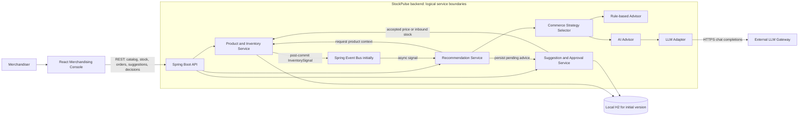
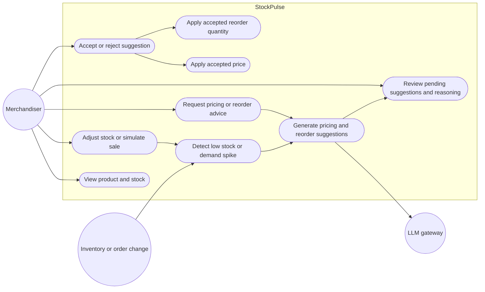
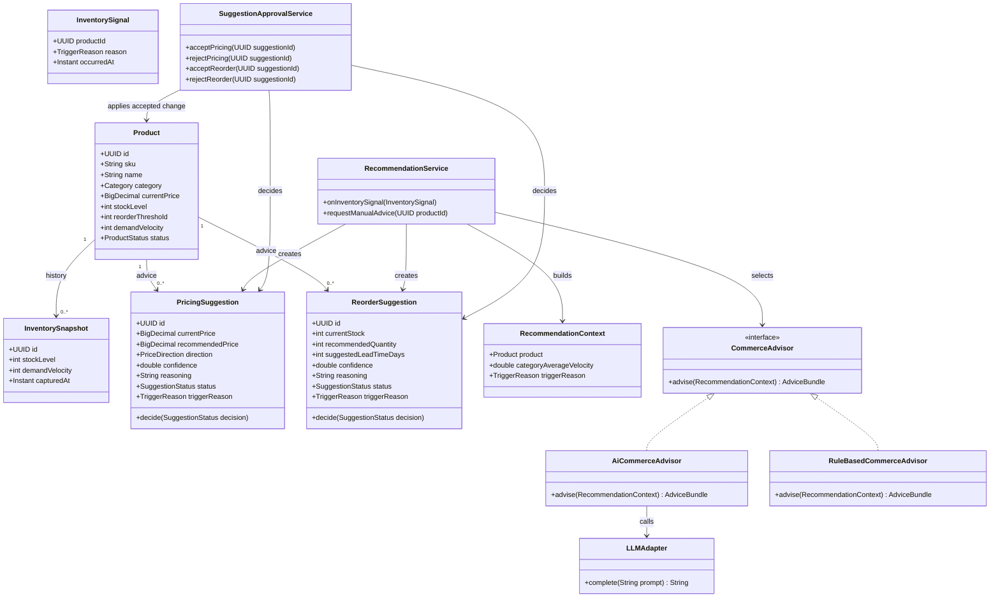
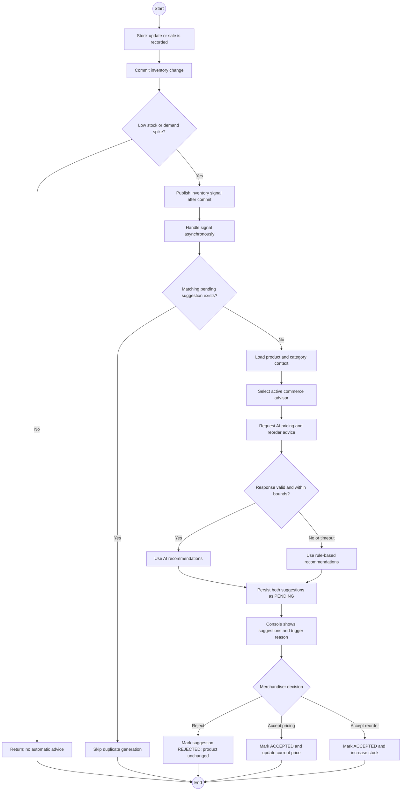

# StockPulse Architecture

## Logical Services

| Service or component | Responsibility |
| --- | --- |
| React Merchandising Console | Display products and pending suggestions; simulate sales and stock changes; request advice; accept or reject suggestions. |
| API Gateway / Backend API | Expose REST endpoints to React, validate requests, and route commands to backend services. In the initial version this is the Spring Boot web/API layer, not a separate gateway deployment. |
| Product and Inventory Service | Own product details, stock, simulated orders, inventory snapshots, and low-stock or demand-spike signal detection. |
| Recommendation Service | Consume inventory signals, prevent duplicate pending work, select AI or rule-based strategy, and request pricing and reorder advice. |
| Suggestion and Approval Service | Store pending pricing/reorder suggestions and their lifecycle; apply accepted price or simulated stock changes through the Product and Inventory Service. |
| LLM Adapter | Backend-only connector to the configured OpenAI-compatible gateway; handles request mapping, timeout, response parsing, and validation. It is a component of the Recommendation Service initially, not a separate deployed service. |
| H2 Database | Local SQL database for the initial application. For independently deployed services, give each service ownership of its own database; do not have services write to another service's tables. |
| External LLM Gateway | Supplies model responses to the LLM Adapter. The API key stays on the backend and is read from an environment variable. |

**Deployment note:** The generated project currently contains a single Spring Boot application and H2 dependency, not independently deployed microservices. Build the boundaries as modules inside that application first, using Spring application events. Split into networked services and add a durable message broker only when independent deployment or scaling is needed.

## Component Diagram

## Use-Case Diagram

## Class Diagram

## Activity Diagram: Signal to Human Decision

## State and Ownership Rules

- Inventory or order changes commit before their signal is handled asynchronously.
- The recommendation service creates proposals; it never publishes prices or places orders.
- Suggestions transition from `PENDING` to `ACCEPTED` or `REJECTED` exactly once.
- Only an accepted pricing suggestion changes `Product.currentPrice`; only an accepted reorder suggestion increases stock.
- AI failure or invalid output uses the rule-based advisor. Repeated events must not create duplicate pending suggestions for the same product, trigger reason, and suggestion type.
